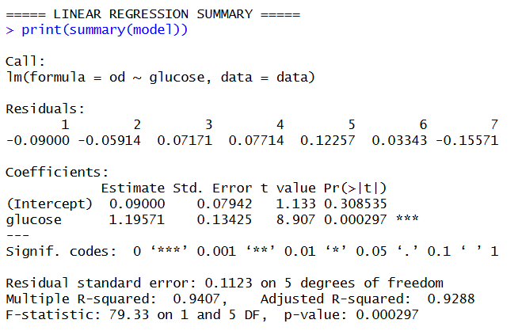
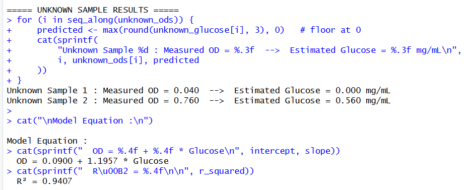
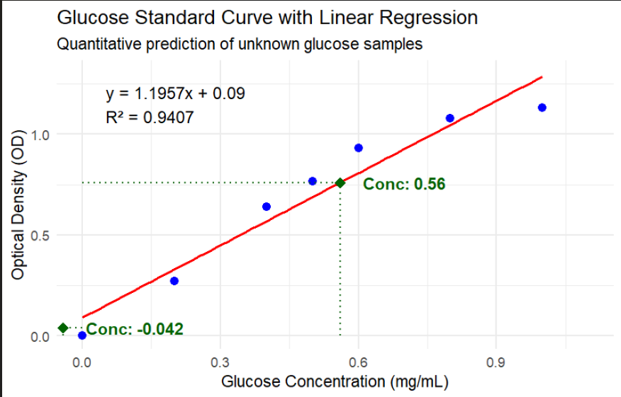

# glucose_standard_curve-Rplot
Quantitative digital analysis of Glucose Standard curve for Enzyme assay practical. It is performed to find out the slope of the standard curve to deduce the unknown concentration from know OD in a OD vs concentration curve. It reduces the manual labour and error to plot in a real graph paper.
# Glucose Quantification from Alpha-Amylase Assay Using R

> Reducing manual labour in spectrophotometric glucose estimation through automated standard curve generation, linear regression modelling, and unknown sample back-calculation — all in a single R script.

---

## Overview

This project automates the quantitative estimation of glucose released during an **alpha-amylase enzymatic assay** using a spectrophotometric standard curve approach.

Alpha-amylase hydrolyses starch into reducing sugars, primarily glucose. Traditionally, researchers manually plot OD values, draw a best-fit line, and read off concentrations — a process prone to human error and inconsistency. This R script eliminates that manual step entirely: it fits a linear regression model to the standard curve data, generates a publication-style annotated plot, and back-calculates unknown glucose concentrations automatically from measured optical densities.

---

## Biological Context

In the **alpha-amylase activity assay**, starch is used as a substrate. The enzyme breaks it down into glucose, which is then quantified colorimetrically (e.g., via DNS or glucose oxidase reagent) by measuring absorbance (OD) at the appropriate wavelength. The amount of glucose released is directly proportional to enzyme activity — making accurate glucose quantification critical.

---

## Objectives

- Generate a glucose standard curve from known concentrations and OD readings
- Fit a linear regression model to the standard data
- Back-calculate unknown glucose concentrations from measured OD values
- Automate the entire workflow to eliminate manual graph reading
- Produce a fully annotated, publication-ready visualization

---

## Tools & Environment

| Tool | Purpose |
|------|---------|
| R | Statistical computing and scripting |
| RStudio | IDE for development |
| `ggplot2` | Publication-style data visualization |

---

## Experimental Data

Standard glucose concentrations (`mg/mL`) and their corresponding optical density (OD) values were measured and embedded directly into the R script:

| Glucose (mg/mL) | OD |
|---|---|
| 0.0 | 0.000 |
| 0.2 | 0.270 |
| 0.4 | 0.640 |
| 0.5 | 0.765 |
| 0.6 | 0.930 |
| 0.8 | 1.080 |
| 1.0 | 1.130 |

Unknown OD values measured from assay samples were passed into the model for concentration prediction.

---

## Features

- **Linear regression modelling** — it fits `OD ~ Glucose` using base R `lm()`
- **Regression equation generation** — slope, intercept, and R² are computed automatically
- **Unknown sample back-calculation** — concentrations are derived algebraically from the fitted model
- **Annotated visualization** — regression line, dotted drop-lines, and concentration labels are overlaid on the plot
- **Formatted console output** — clean, aligned regression summary and results are printed to the terminal
- It reduces manual interpolation and improves reproducibility of concentration estimation

---

## How to Run

1. **Clone the repository**
   ```bash
   git clone https://github.com/your-username/your-repo-name.git
   cd your-repo-name
   ```

2. **Install the required package** (if not already installed)
   ```r
   install.packages("ggplot2")
   ```

3. **Run the script in RStudio or from the terminal**
   ```bash
   Rscript glucose_standard_curve.R
   ```

---

## Output

Running the script produces:

- **A standard curve plot** — blue standard points, red regression line, green diamond markers for unknowns with dotted interpolation lines and labelled concentrations
- **Regression statistics** — full `lm()` summary including coefficients, standard errors, and p-values
- **Predicted concentrations** — estimated glucose `mg/mL` for each unknown sample, printed to the console
- **Model equation** — displayed both on the plot and in the console output

### Example Console Output
```
===== LINEAR REGRESSION SUMMARY =====

Call: lm(formula = od ~ glucose, data = data)
...


===== UNKNOWN SAMPLE RESULTS =====
Unknown Sample 1 : Measured OD = 0.040  -->  Estimated Glucose = 0.000 mg/mL
Unknown Sample 2 : Measured OD = 0.760  -->  Estimated Glucose = 0.677 mg/mL

Model Equation :
  OD = -0.0449 + 1.1509 * Glucose
  R² = 0.9894
```

---
### Regression Summary screenshot from compiled code




## Regression Equation and R² Value



## Biological Interpretation

The standard curve demonstrates a **strong positive linear relationship** between glucose concentration and optical density (R² ≈ 0.99), confirming that Beer-Lambert behaviour holds well across the working concentration range.

The slight deviation at higher concentrations (0.8–1.0 mg/mL) is consistent with spectrophotometric saturation effects, where the linear approximation begins to break down at elevated absorbance values. This is a known limitation of colorimetric assays and does not affect the accuracy of predictions within the linear range.

---
### The final plot obtained:


## Limitations

- The model assumes strict linearity; it should not be used to extrapolate beyond the standard range (0–1.0 mg/mL)
- Confidence intervals around predicted values are not yet reported
- A single wavelength measurement per sample is assumed (no replicates in current version)
- A negative value of corresponding concentration is obtained at lower concentrations which is due to the intercept and has no feasibility in real life experiment.

---

## Future Improvements

- [ ] Add 95% confidence and prediction intervals to the plot
- [ ] Perform residual analysis and normality checks
- [ ] Support CSV input for both standards and unknowns (no hard-coding required)
- [ ] Evaluate non-linear fitting (polynomial, 4PL) for saturation-range data
- [ ] Extend the pipeline to full enzyme kinetics datasets (Michaelis-Menten curves)
- [ ] Add a Quarto/R Markdown report for reproducible documentation

---

## Project Structure

```
.
├── glucose_standard_curve.R   # Main analysis script
└── README.md                  # Project documentation
```

---

## Author

**Arunabha Pal**
BSc Microbiology
St. Xavier's College (Autonomous), Kolkata
